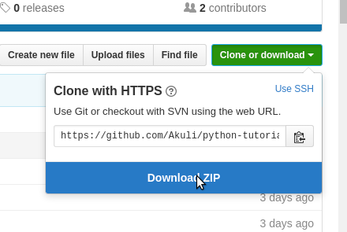

**Beginner Python programming lesson**    
This is a brief Python 3 programming lesson for those who find reading tedious. I strive to demonstrate everything with simple code examples; there are no lengthy explanations with fancy terminology. If you've never coded before, go here to learn more about it and get started.

This lesson is intended for those who have no programming experience or very little programming experience. If you've already coded in another language, you may wish to read the official instruction instead.

You can download the code from here: 

