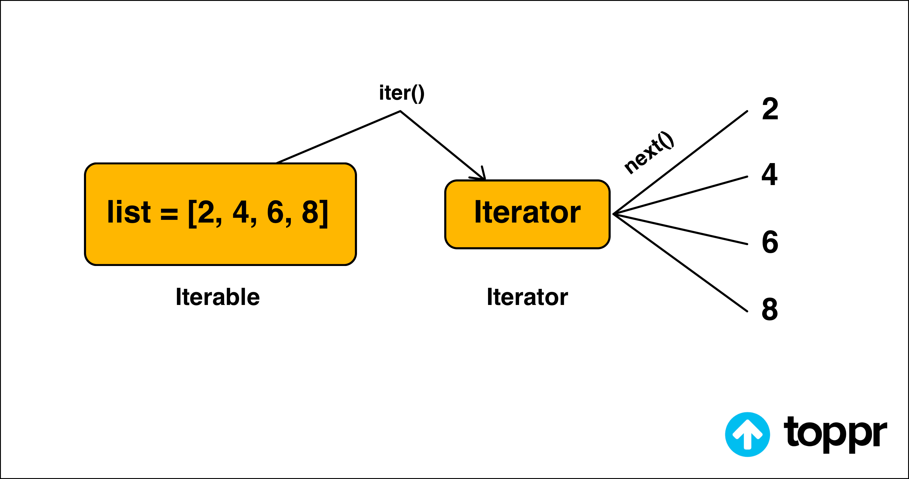
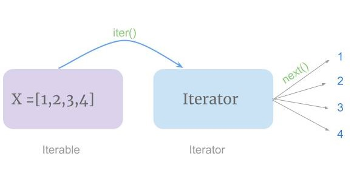

An iterator is an object that contains a countable number of values. An iterator is an object that can be iterated upon, meaning that you can traverse through all the values. Technically, in Python, an iterator is an object which implements the iterator protocol, which consist of the methods __iter__() and __next__() .

Iterators allow lazy evaluation, only generating the next element of an iterable object when requested. This is useful for very large data sets. Iterators and generators can only be iterated over once. Generator Functions are better than Iterators.

Iterator in Python is an object that is used to iterate over iterable objects like lists, tuples, dicts, and sets. The iterator object is initialized using the iter() method. It uses the next() method for iteration.

__iter__(): The iter() method is called for the initialization of an iterator. This returns an iterator object
__next__(): The next method returns the next value for the iterable. When we use a for loop to traverse any iterable object, internally it uses the iter() method to get an iterator object, which further uses the next() method to iterate over. This method raises a StopIteration to signal the end of the iteration.

